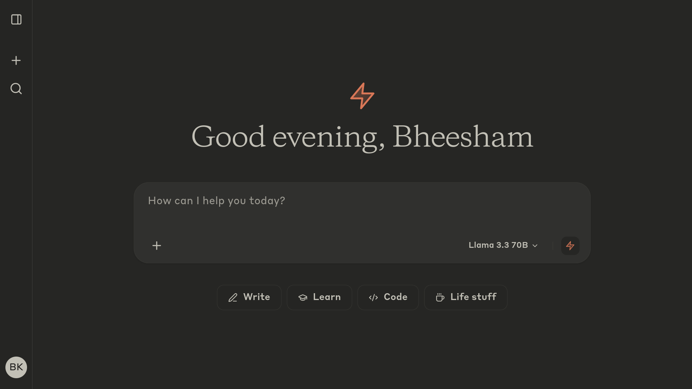
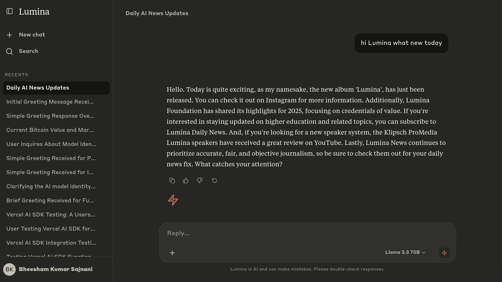
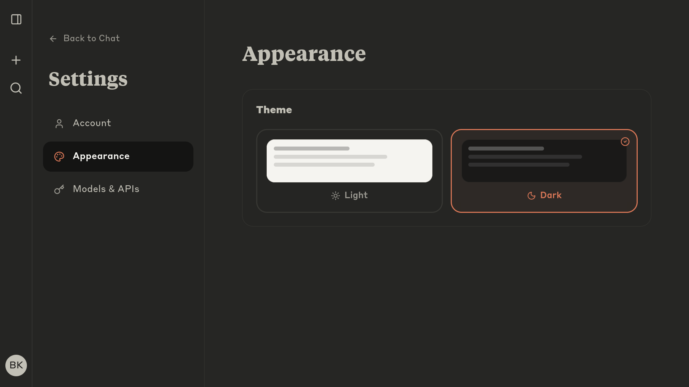
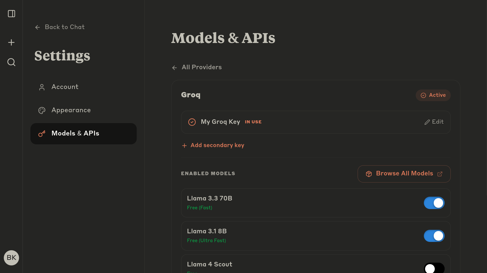
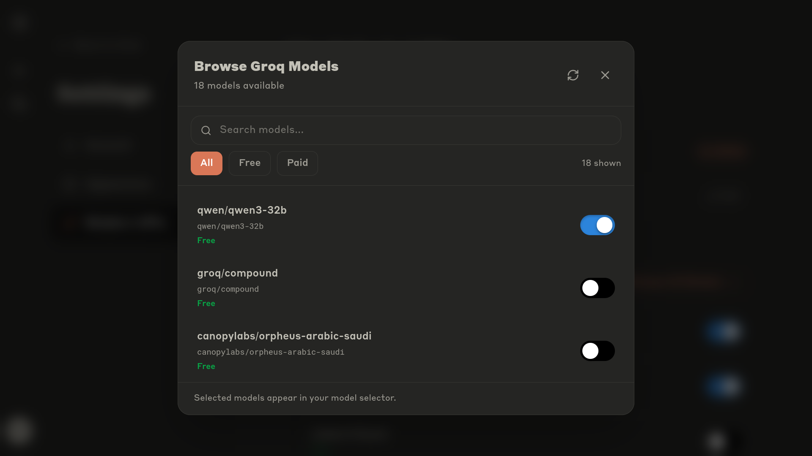
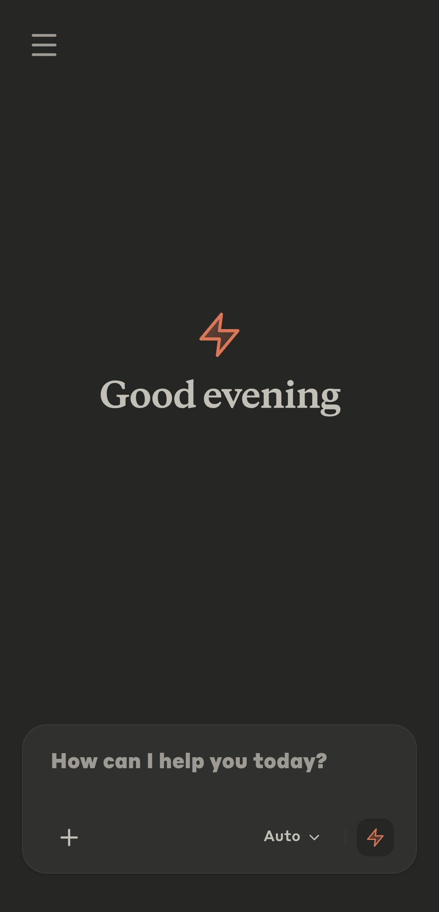

# Lumina AI

A BYOK (Bring Your Own Key) AI chat interface — multi-provider, self-hostable, and built with a clean UI inspired by Claude.ai.




---

## What is Lumina AI?

Lumina AI lets you bring your own API keys and chat with multiple LLM providers from a single, polished interface. No subscriptions. No vendor lock-in. Your keys, your data.

---

## Features

- 🔑 **Bring Your Own Key** — Connect your own API keys for any supported provider
- 🤖 **Multi-provider routing** — Switch between models from different providers mid-session
- 🌐 **Web search** — Integrated Tavily-powered search for grounded responses
- 💬 **Conversation history** — Persistent chat history with rename & delete support
- 🔐 **Auth** — Google OAuth via Supabase
- 📱 **Responsive** — Fully mobile-optimized with native-feeling gestures
- 🎨 **Themeable** — Clean light and dark Mode

---

## Supported Providers

Lumina AI ships with a curated registry of models out of the box. Users can also **Browse Models** to fetch and add any model available from a given provider.

| Provider | Built-in Models | Notes |
|---|---|---|
| **Google** | Gemini 2.5 Flash · Gemini 2.5 Pro · Gemini 2.0 Flash | Free tier available |
| **OpenAI** | GPT-4o · GPT-4o Mini · o3 Mini | Paid |
| **Groq** | Llama 3.3 70B · Llama 3.1 8B · Llama 4 Scout · Qwen 3 32B | Free (rate-limited) |
| **DeepSeek** | DeepSeek V3 · DeepSeek R1 | Paid |
| **Mistral** | Mistral Large · Codestral | Paid |
| **xAI** | Grok 2 | Paid |
| **Perplexity** | Sonar Pro · Sonar Reasoning Pro | Paid · Search-grounded |
| **TogetherAI** | Llama 3.3 70B Turbo · Qwen 2.5 Coder | Paid |
| **OpenRouter** | Auto · Llama 3.3 70B · DeepSeek R1 · GLM 4.5 Air · Claude 3.7 Sonnet · GPT-4o · Gemini 2.5 Pro · Grok 3 · and more | Free + Paid; guest fallback |

> **Browse Models** — authenticated users can fetch the full live model list from any provider and pin any model to their model selector.

---

## Screenshots

| Chat | Settings |
|---|---|
|  |  |

| Model Selector | Browse Models |
|---|---|
|  |  |

| Mobile |
|---|
|  |
---

## Tech Stack

- **Frontend** — React, Vite, Tailwind CSS v4
- **LLM Routing** — Vercel AI SDK with per-provider tool-call support
- **Auth & DB** — Supabase (Google OAuth + user config storage)
- **Web Search** — Tavily API
- **Hosting** — Vercel (serverless API proxy in `/api/chat.js`)

---

## Running Locally

### Prerequisites

- Node.js 18+
- [Vercel CLI](https://vercel.com/docs/cli) — `npm i -g vercel`
- A Supabase project with Google OAuth configured

### Setup

```bash
git clone https://github.com/BheeshamKS/lumina-ai.git
cd lumina-ai
npm install
vercel link
```

Create a `.env.local` file:

```env
VITE_SUPABASE_URL=your_supabase_url
VITE_SUPABASE_ANON_KEY=your_supabase_anon_key
VITE_TAVILY_API_KEY=your_tavily_api_key
OPENROUTER_KEY=your_openrouter_key   # guest fallback
```

Then run:

```bash
vercel dev
```

> ⚠️ Use `vercel dev` instead of `npm run dev` so the serverless `/api/chat.js` proxy runs correctly and your API keys stay server-side.

---

## Deployment

Deploy to Vercel with one click or via CLI:

```bash
vercel --prod
```

Set all environment variables in the Vercel dashboard. Mark server-only vars (like `OPENROUTER_KEY`) as **uncheck "Browser"** so they aren't exposed client-side.

---

## Contributing

Pull requests are welcome! Feel free to open an issue for bugs or feature ideas. Please read the license section below before contributing — commercial use is not permitted.

---

## License and Copyright

**© 2026 Bheesham Kumar Sajnani. All Rights Reserved.**

Lumina AI is source-available and licensed under the **PolyForm Noncommercial License 1.0.0**.

You are free to read the code, learn from it, run it locally, and submit pull requests to help improve the project. However, **you may not use this software, or any of its code, for commercial purposes.** The "Lumina AI" name, branding, and logos are strictly protected and may not be used in derivative works.

See the [LICENSE](./LICENSE) file for full details.